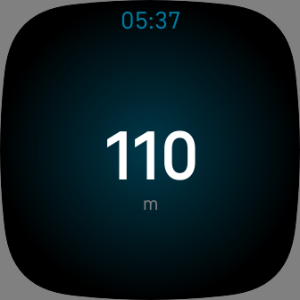

### Pure Altimeter

A simple altimeter for Fitbit Versa 3 and Fitbit Sense, that uses the barometric
sensor to simulate an altimeter.

Installable from [Fitbit Apps gallery](https://gallery.fitbit.com/details/93d7ab43-6271-4d9f-a77b-b4a55c26f1f0).

Icon made by [Freepik](https://www.flaticon.com/authors/freepik) from
[Flaticon](https://www.flaticon.com/)
